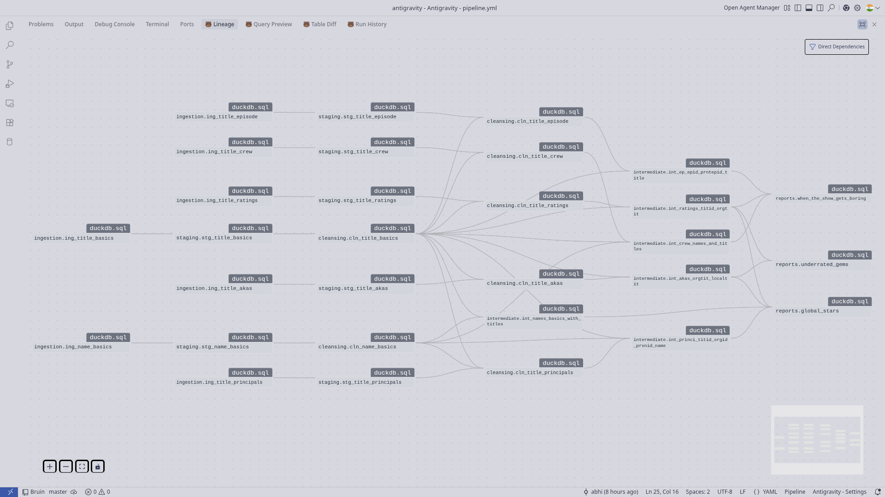
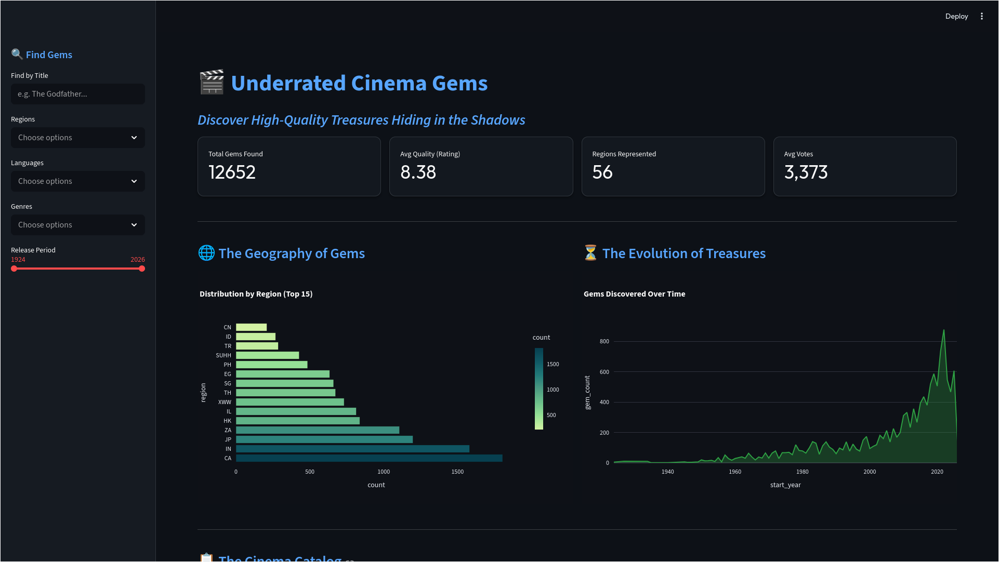
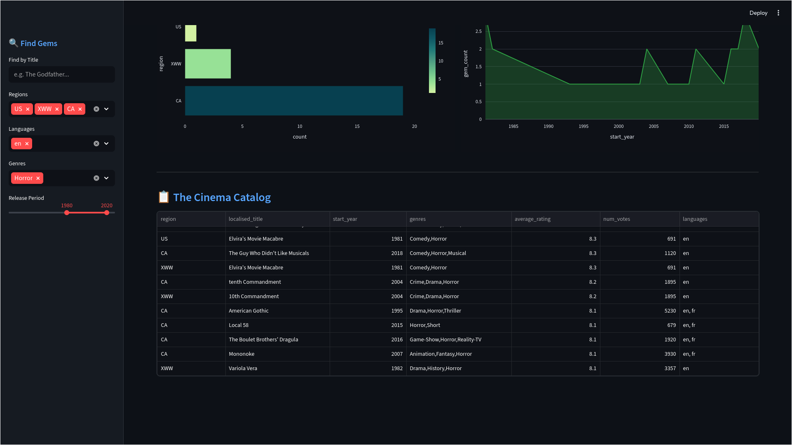
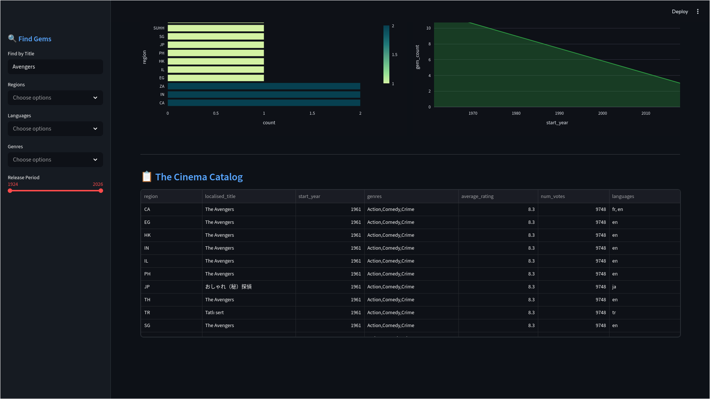

# 🎬 IMDb Data Pipeline

A production-grade data pipeline built with **[Bruin CLI](https://github.com/bruin-data/bruin)** and **DuckDB** that ingests, cleans, transforms, and analyzes the entire IMDb non-commercial dataset (~15M+ titles, ~13M+ people, ~11GB data, 500 million rows). The pipeline follows a strict layered architecture and powers three analytical reports and an interactive Streamlit dashboard.

---

## 🎓 Course Project Achievement Summary

This project was built for the **Data Engineering Zoomcamp**. Below is a summary of how the pipeline fulfills the official evaluation criteria.

| Criterion | Status | Achievement Details |
|-----------|-----------|--------------------|
| **Problem Description** | ✅ Complete | Well-documented analytical case study for finding "Underrated Gems" and monitoring "Architectural Integrity." |
| **Cloud** | ⚠️ Local-First | **By Design**: Optimized for high-performance **local** execution via DuckDB. |
| **Data Ingestion** | ✅ Complete | Complex 5-layer batch pipeline orchestrated by **Bruin** with 30+ SQL assets. |
| **Data Warehouse** | ✅ Complete | Powered by **DuckDB** with star-schema modeling and optimized materialization strategies. |
| **Transformations** | ✅ Complete | Sophisticated SQL logic using Bruin (dbt-alternative) with `UNNEST`, `LATERAL JOIN`, and window functions. |
| **Dashboard** | ✅ Complete | **Streamlit** dashboard with 2+ tiles: Temporal (Decades) and Categorical (Regions). |
| **Reproducibility** | ✅ Complete | Clear "Quick Start" guide and standalone configuration provided. |

---

## Table of Contents

- [Problem Statement](#problem-statement)
- [Architecture Overview](#architecture-overview)
- [Pipeline Layers](#pipeline-layers)
- [Reports](#reports)
- [Dashboard](#dashboard)
- [Data Quality](#data-quality)
- [Setup & Installation](#setup--installation)
- [Running the Pipeline](#running-the-pipeline)
- [Challenges & Lessons Learned](#challenges--lessons-learned)
- [Project Structure](#project-structure)
- [Quick Start](#quick-start)

---

## Problem Statement

At a time when over **15 million titles** and **13 million entertainment professionals** are listed on IMDb, both audiences and industry analysts face a "Discovery Paradox":

1.  **Audience Problem**: High-quality content is often buried under mainstream marketing. Finding "Underrated Gems"—films with elite ratings but low vote counts—requires sophisticated filtering across global datasets.
2.  **Industry Problem**: TV series often experience creative decline over time. There is no standard metrics to measure at what point a show loses its "original creative DNA" (the involvement of original creators).
3.  **Technical Problem**: Processing the entire IMDb dataset typically requires expensive cloud infrastructure. This project aims to prove that a **portable, production-grade pipeline** can solve these complex analytical problems using high-performance local tools like Bruin and DuckDB.

---

## Quick Start

Assuming you have **Bruin CLI** and **uv** installed:

```bash
# 1. Clone/Navigate to project
cd imdb-cinema-insights-pipeline

# 2. Run the full pipeline
bruin run .

# 3. Launch the dashboard
uv run streamlit run dashboard/app.py
```

---

## Architecture Overview

```
IMDb Datasets (7 .tsv.gz files, refreshed daily)
        │
        ▼
┌──────────────┐    ┌──────────────┐    ┌──────────────┐    ┌──────────────────┐    ┌──────────────┐
│  Ingestion   │───▶│   Staging    │───▶│  Cleansing   │───▶│  Intermediate     │───▶│   Reports    │
│  (7 assets)  │    │  (7 assets)  │    │  (7 assets)  │    │  (6 views)        │    │  (3 assets)  │
│              │    │              │    │              │    │                    │    │              │
│  Raw CSV     │    │  Type cast   │    │  Feature     │    │  Cross-table       │    │  Analytical  │
│  read_csv()  │    │  Dedup       │    │  engineer    │    │  joins, UNNEST,    │    │  aggregates  │
│              │    │  Null handle │    │  Outlier cap │    │  STRING_AGG        │    │              │
└──────────────┘    └──────────────┘    └──────────────┘    └──────────────────┘    └──────────────┘
                                                                                           │
                                                                                           ▼
                                                                                   ┌──────────────┐
                                                                                   │  Dashboard   │
                                                                                   │  (Streamlit) │
                                                                                   └──────────────┘
```



**Tech Stack**: Bruin CLI · DuckDB · SQL · Python · Streamlit · Plotly

The pipeline is built using Bruin's native **`duckdb.sql`** asset type, ensuring optimal performance and seamless integration with DuckDB's analytical engine.

---

## Pipeline Layers

### 1. Ingestion (`assets/ingestion/`)

Reads 7 gzipped TSV files directly from [IMDb's public dataset endpoint](https://datasets.imdbws.com/) using DuckDB's native `read_csv()` with gzip decompression. No intermediate file downloads required.

| Asset                    | Source File              |
|--------------------------|--------------------------|
| `ing_title_basics`       | `title.basics.tsv.gz`   |
| `ing_title_akas`         | `title.akas.tsv.gz`     |
| `ing_title_crew`         | `title.crew.tsv.gz`     |
| `ing_title_episode`      | `title.episode.tsv.gz`  |
| `ing_title_principals`   | `title.principals.tsv.gz` |
| `ing_title_ratings`      | `title.ratings.tsv.gz`  |
| `ing_name_basics`        | `name.basics.tsv.gz`    |

Key detail: The `\N` string used by IMDb for null values is handled at the `read_csv` level via the `nullstr='\N'` parameter.

### 2. Staging (`assets/staging/`)

Applies explicit type casting (`CAST`), column renaming to snake_case, and row-level deduplication (`SELECT DISTINCT ON`). Each staging asset also includes a `row_count_positive` custom check to ensure the load was not empty.

### 3. Cleansing (`assets/cleansing/`)

This is where the data gets shaped for analysis. Key transformations include:

- **`cln_title_basics`**: Derives a `decade` feature (e.g., `"1990s"`), caps `runtime_minutes` at 5000 (removing outliers), trims overly long titles to 40 characters, and filters impossible records (e.g., `start_year > end_year`).
- **`cln_name_basics`**: Derives `is_alive` (boolean), `age` (computed dynamically from `current_date`), `birth_century`, and `display_name` (e.g., `"Alfred Hitchcock (1899)"`).
- **`cln_title_ratings`**: Inner-joins ratings to `cln_title_basics` to ensure every rated title actually exists in the clean title catalog.

### 4. Intermediate (`assets/intermediate/`)

Six views that perform the heavy relational lifting. These are materialized as **views** (not tables) to avoid unnecessary storage while keeping queries composable.

| View | Purpose |
|------|---------|
| `int_akas_orgtit_localtit` | Maps localized titles to original titles by region and language |
| `int_ratings_titid_orgtit` | Enriches ratings with title metadata (genre, year, type) |
| `int_names_basics_with_titles` | Resolves `known_for_titles` IDs into human-readable names using `UNNEST` + `LATERAL JOIN` + `STRING_AGG` |
| `int_crew_names_and_titles` | Unnests comma-separated director/writer IDs and joins them to their names |
| `int_ep_epid_prntepid_title` | Links episodes to their parent series with season/episode numbers |
| `int_princi_titid_orgid_prsnid_name` | Resolves principals (actors, crew) to their names and character roles |

### 5. Reports (`assets/reports/`)

Three analytical outputs that answer distinct questions about the entertainment industry.

---

## Reports

### Underrated Gems (`reports.underrated_gems`)

> *"What high-quality content is flying under the radar?"*

Identifies titles with **8.0+ average rating** but only **500–10,000 votes** — the sweet spot where critical quality meets low mainstream visibility. Results are ranked per region using `DENSE_RANK()`, revealing which countries produce the most "hidden treasures."

### Global Stars (`reports.global_stars`)

> *"Who are the most influential people in entertainment, globally?"*

Computes a **Global Star Index** using the formula:

```
Global Star Index = AVG(rating) × LOG10(SUM(votes)) × AVG(countries_reached)
```

This composite metric balances quality, popularity, and international reach. Artists are ranked within their specific profession (actor, director, writer, etc.).

### When the Show Gets Boring (`reports.when_the_show_gets_boring`)

> *"At what point do TV series lose their original creative DNA?"*

Calculates an **Architectural Integrity Score** per season by checking whether the original creators (directors and writers of the series) are still involved in each episode. A declining score often correlates with declining ratings — the data shows when a show starts "phoning it in."

---

## Dashboard

An interactive **Streamlit** dashboard that visualizes the Underrated Gems report.



**Features:**
- **Categorical Distribution**: Horizontal bar chart of gems grouped by region
- **Temporal Distribution**: Area chart showing the volume of gems across release years
- **Interactive Filters**: Search by title, filter by region, language, genre, and release period
- **Summary Metrics**: Total gems found, average quality rating, regions represented, average votes

### Multi-dimensional Analysis

The dashboard reacts dynamically to complex filter combinations. Below, the system is filtering for specific regions, languages (English), and genres (Horror) simultaneously, updating the "Geography of Gems" and "Evolution of Treasures" visualizations in real-time:



### Interactive Discovery & Search

The dashboard enables deep-dive discovery using interactive Plotly charts and Streamlit sidebar filters. Below is an example of searching for specific titles (e.g., "Avengers") while maintaining categorical filters:



**To launch from the project root:**

```bash
uv run streamlit run dashboard/app.py
```

Then open `http://localhost:8501` in your browser.

---

## Data Quality

The pipeline enforces data integrity through **45 column-level checks** and **23 custom SQL checks** across all layers.

By design, most checks are **blocking**. If a critical check (like a primary key uniqueness or not-null constraint) fails, Bruin automatically halts the pipeline and prevents downstream assets from executing, ensuring that analytical reports are never built on "polluted" data.

| Check Type | Count | Examples |
|------------|-------|---------|
| `not_null` | 45 | Applied to all primary keys, report columns, and critical fields |
| `primary_key` | 10+ | Ensures uniqueness of `title_id`, `person_id`, etc. |
| `row_count_positive` | 23 | Every asset verifies it produced non-empty output |
| Domain-specific | 3 | `runtime_integrity_check` (no runtimes > 5000), `decade_format_check`, `birth_year < death_year` |

---

## Setup & Installation

### Prerequisites

- **Python 3.13+**
- **[Bruin CLI](https://github.com/bruin-data/bruin)** (install via `curl`)
- **[uv](https://github.com/astral-sh/uv)** (Python package manager)

### Step 1: Install Bruin CLI

```bash
# macOS / Linux
curl -LsSf https://raw.githubusercontent.com/bruin-data/bruin/refs/heads/main/install.sh | sh
```

Verify:
```bash
bruin --version
```

### Step 2: Clone and configure

```bash
git clone https://github.com/abhi-st-DE/imdb-cinema-insights-pipeline.git
cd imdb-cinema-insights-pipeline
```

The environment file `.bruin.yml` at the project root configures the DuckDB connection:

```yaml
default_environment: default
environments:
  default:
    connections:
      duckdb:
        - name: duckdb-default
          path: duckdb.db
```

> [!NOTE]
> In production environments, `.bruin.yml` is typically ignored for security. For this repository, it is included to ensure the project is immediately portable and "runnable" for peers and reviewers.

### Step 3: Install dashboard dependencies

```bash
uv add streamlit plotly pandas duckdb
```

This installs all packages strictly within the project's local `.venv` — nothing touches your system Python.

---

## Running the Pipeline

### Full pipeline execution (from root)

```bash
bruin run .
```

### Run a single asset

```bash
bruin run assets/reports/underrated_gems.sql
```

### Run with quality checks only (validation mode)

```bash
bruin run --downstream assets/staging/stg_title_basics.sql
```
### Launch the dashboard

```bash
uv run streamlit run dashboard/app.py
```

---

## Developer Workflow

Bruin provides powerful commands to ensure code quality before execution:

### Validation
Check for schema errors, broken dependencies, or connection issues without running data:
```bash
bruin validate .
```

### Lineage
Visualize the pipeline's dependency graph:
```bash
bruin lineage .
```

### Format
Standardize SQL and Python formatting across the project:
```bash
bruin format .
```

---

## Challenges & Lessons Learned

### Out of Memory (OOM) Errors
DuckDB's in-memory processing struggled with cross-joins on 13M+ person records. Resolved by configuring global pre-hooks in `pipeline.yml`:

```yaml
default:
  hooks:
    pre:
      - query: "SET memory_limit = '8GB';"
      - query: "SET temp_directory = '/path/to/bruin_temp';"
      - query: "PRAGMA max_temp_directory_size='50GB';"
      - query: "SET preserve_insertion_order = false;"
```

This enables DuckDB to spill intermediate results to disk instead of crashing.

### Null Handling: The `\N` Problem
IMDb uses the literal string `\N` to represent null values. Attempting to `CAST('\N' AS INTEGER)` causes silent failures or errors. The project handles this at the ingestion layer using `nullstr='\N'`, ensuring data integrity from the start.

### Ambiguous Column References
As intermediate views grew in complexity (4–5 table joins), DuckDB's strict SQL parser raised "Ambiguous reference" errors. Every join now uses explicit table aliases, which also improved readability.

### The "Splitting Star" Bug
A person with multiple professions (e.g., "actor, director") was being duplicated into separate rows after `UNNEST`. This inflated counts in downstream reports. Solved by using `STRING_AGG(DISTINCT ...)` with `ORDER BY` in the intermediate layer.

### Title Deduplication
The same title can appear multiple times across regions, languages, and alternative name variants. The Underrated Gems report uses `ARG_MIN(localised_title, ordering)` to pick the most "official" variant per region, and `STRING_AGG(DISTINCT language, ', ')` to aggregate languages without row explosion.

---

## Project Structure

```
imdb-cinema-insights-pipeline/
├── pipeline.yml                          # Pipeline config, DuckDB hooks, dataset URLs
├── .bruin.yml                            # Database connection configuration
├── .gitignore                            # Files and folders to ignore in Git
├── pyproject.toml                        # Python dependencies (uv/pip)
├── uv.lock                               # Locked versions of Python dependencies
├── README.md                             # This file
├── dashboard/
│   └── app.py                            # Streamlit dashboard (Underrated Cinema Gems)
├── docs/
│   └── images/                           # High-quality visual assets for documentation
└── assets/
    ├── imdb_data_dict.md                 # IMDb dataset schema reference
    ├── ingestion/                        # Layer 1: Raw data ingestion (7 assets)
    │   ├── ing_name_basics.sql
    │   ├── ing_title_akas.sql
    │   ├── ing_title_basics.sql
    │   ├── ing_title_crew.sql
    │   ├── ing_title_episode.sql
    │   ├── ing_title_principals.sql
    │   └── ing_title_ratings.sql
    ├── staging/                          # Layer 2: Type casting & dedup (7 assets)
    │   ├── stg_name_basics.sql
    │   ├── stg_title_akas.sql
    │   ├── stg_title_basics.sql
    │   ├── stg_title_crew.sql
    │   ├── stg_title_episode.sql
    │   ├── stg_title_principals.sql
    │   └── stg_title_ratings.sql
    ├── cleansing/                        # Layer 3: Feature engineering (7 assets)
    │   ├── cln_name_basics.sql
    │   ├── cln_title_akas.sql
    │   ├── cln_title_basics.sql
    │   ├── cln_title_crew.sql
    │   ├── cln_title_episode.sql
    │   ├── cln_title_principals.sql
    │   └── cln_title_ratings.sql
    ├── intermediate/                     # Layer 4: Relational joins (6 views)
    │   ├── int_akas_orgtit_localtit.sql
    │   ├── int_crew_names_and_titles.sql
    │   ├── int_ep_epid_prntepid_title.sql
    │   ├── int_names_basics_with_titles.sql
    │   ├── int_princi_titid_orgid_prsnid_name.sql
    │   └── int_ratings_titid_orgtit.sql
    └── reports/                          # Layer 5: Analytical outputs (3 assets)
        ├── global_stars.sql
        ├── underrated_gems.sql
        └── when_the_show_gets_boring.sql
```

---

## Data Sources

All data is sourced from the [IMDb Non-Commercial Datasets](https://developer.imdb.com/non-commercial-datasets/), refreshed daily. Usage is subject to IMDb's non-commercial licensing terms.

---

*Built with [Bruin](https://github.com/bruin-data/bruin) · Powered by [DuckDB](https://duckdb.org/)*
